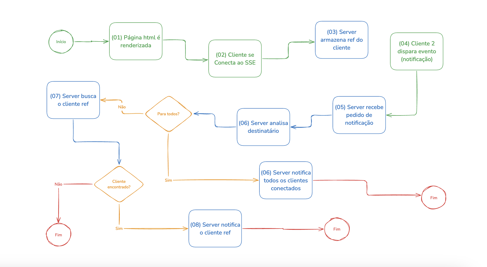

# Exemplo de Servidor SSE (Server-Sent Events)

Este projeto demonstra como implementar um servidor SSE (Server-Sent Events) simples usando **Node.js** e **Express**. O servidor permite enviar mensagens em tempo real para os clientes conectados através de uma conexão persistente, e também permite publicar mensagens para clientes específicos ou para todos os clientes conectados.

---



## Estrutura de Pastas

```
.
└─── server/
  │── index.ts    # Código do servidor Express que serve o arquivo HTML e configura as rotas SSE
  └── index.html  # Arquivo HTML que se conecta ao servidor SSE e exibe as mensagens em tempo real
```

### Explicação da Estrutura de Pastas:

- **`server/index.ts`**: Arquivo principal do servidor Express que configura as rotas para comunicação SSE e envia o arquivo `index.html` quando a raiz do servidor é acessada.
- **`index.html`**: Arquivo HTML que se conecta ao servidor SSE e exibe as mensagens em tempo real.

## Tecnologias

- **Node.js**
- **Express**
- **SSE (Server-Sent Events)**
- **HTML e JavaScript**

## Como Executar o Projeto

### 1. Clonar o repositório

Primeiro, clone o repositório para sua máquina local:

```bash
git clone https://github.com/4lessandrodev/event-source.poc.git
cd event-source.poc
```

### 2. Atualize a variável

No arquivo `index.html` atualize a variável `baseURL` para refletir o endereço do servidor.

Caso esteja executando o projeto local atualize para `http://localhost:3000`

### 3. Construir a Imagem Docker

Para construir a imagem Docker com o nome `event-source-poc` e a tag `v1.0`, use o seguinte comando:

```bash
docker build -t event-source-poc:v1.0 .
```

### 4. Executar o Container Docker

Após construir a imagem, você pode rodar o container na porta desejada. Para mapear a porta `3000` do container para a porta `3000` na sua máquina local, use o comando:

```bash
docker run -p 3000:3000 event-source-poc:v1.0
```

Isso fará com que a aplicação seja acessível em `http://localhost:3000`.

### 5. Acessar a Interface Web

Agora, abra o navegador e vá para `http://localhost:3000`. O servidor Express irá enviar o arquivo `index.html` que está sendo servido pelo seu servidor.

## Rotas do Servidor

### 1. `/`

- **Método**: `GET`
- **Descrição**: Esta rota serve o arquivo `index.html` para o cliente.
- **Exemplo**: `http://localhost:3000/`
  
  Quando o cliente acessar a raiz do servidor, o arquivo `index.html` será enviado e carregado na interface do usuário.

### 2. `/stream/:id`

- **Método**: `GET`
- **Descrição**: Esta rota estabelece uma conexão SSE para o cliente com o `id` fornecido na URL. O servidor envia eventos em tempo real para este cliente.
- **Exemplo**: `http://localhost:3000/stream/<client_id>`
  
  O cliente precisa passar um `id` exclusivo, que será usado para identificar a conexão. Esse `id` pode ser gerado no front-end utilizando a função `crypto.randomUUID()`.

### 3. `/clients`

- **Método**: `GET`
- **Descrição**: Retorna uma lista de todos os `clientId` de clientes conectados.
- **Exemplo**: `http://localhost:3000/clients`
  
  Essa rota permite verificar quais clientes estão conectados no servidor.

### 4. `/publish/:clientId/status/:status`

- **Método**: `GET`
- **Descrição**: Envia um evento para um cliente específico, identificado pelo `clientId`, com o `status` fornecido.
- **Exemplo**: `http://localhost:3000/publish/1234/status/active`

  Esta rota permite enviar uma mensagem personalizada para um cliente específico. O `status` pode ser qualquer valor que você queira que o cliente receba (por exemplo, `active`, `inactive`, etc.).

### 5. `/publish/status/:status`

- **Método**: `GET`
- **Descrição**: Envia um evento com o `status` para **todos os clientes** conectados.
- **Exemplo**: `http://localhost:3000/publish/status/maintenance`

  Com essa rota, você pode publicar uma mensagem para todos os clientes conectados simultaneamente.

## Curl

```bash
# 1. Conectar um cliente para receber SSE
curl -N http://localhost:3000/stream/1234

# 2. Obter a lista de clientes conectados
curl http://localhost:3000/clients

# 3. Publicar um status para um cliente específico
curl http://localhost:3000/publish/1234/status/active

# 4. Publicar um status para todos os clientes
curl http://localhost:3000/publish/status/maintenance
```

## Como Funciona

### Servidor:

- **Conexões SSE**: O servidor mantém uma conexão persistente com cada cliente conectado. Ele envia dados de forma contínua para os clientes por meio da rota `/stream/:id`.
- **Publicação de Status**: A rota `/publish/:clientId/status/:status` permite enviar um evento específico para um cliente, enquanto a rota `/publish/status/:status` envia um evento para todos os clientes conectados.
- **Envio de `index.html`**: A rota `/` envia o arquivo `index.html` como resposta para o cliente, que se conecta ao servidor SSE.

### Front-end:

- O **front-end** em `index.html` usa a API `EventSource` para se conectar ao servidor e exibir as mensagens recebidas em tempo real. As mensagens são exibidas em uma lista `<ul>`, e a rolagem automática para o final da lista é feita conforme novas mensagens são recebidas.

## Exemplo de Mensagens no Front-End

O front-end exibirá as mensagens recebidas na interface da seguinte maneira:

```plaintext
Status: active
Status: maintenance
```

## Considerações

- Este exemplo é adequado para um cenário de teste ou aprendizado. Para um ambiente de produção, considere adicionar **segurança**, **gerenciamento de erros** e **escalabilidade**, como Redis para gerenciar múltiplas instâncias de servidores.
- Este projeto pode ser expandido para incluir funcionalidades como **autenticação**, **validação de dados** e **logs detalhados**.

## Licença

Este projeto está licenciado sob a MIT License - consulte o arquivo [LICENSE](LICENSE) para mais detalhes.
